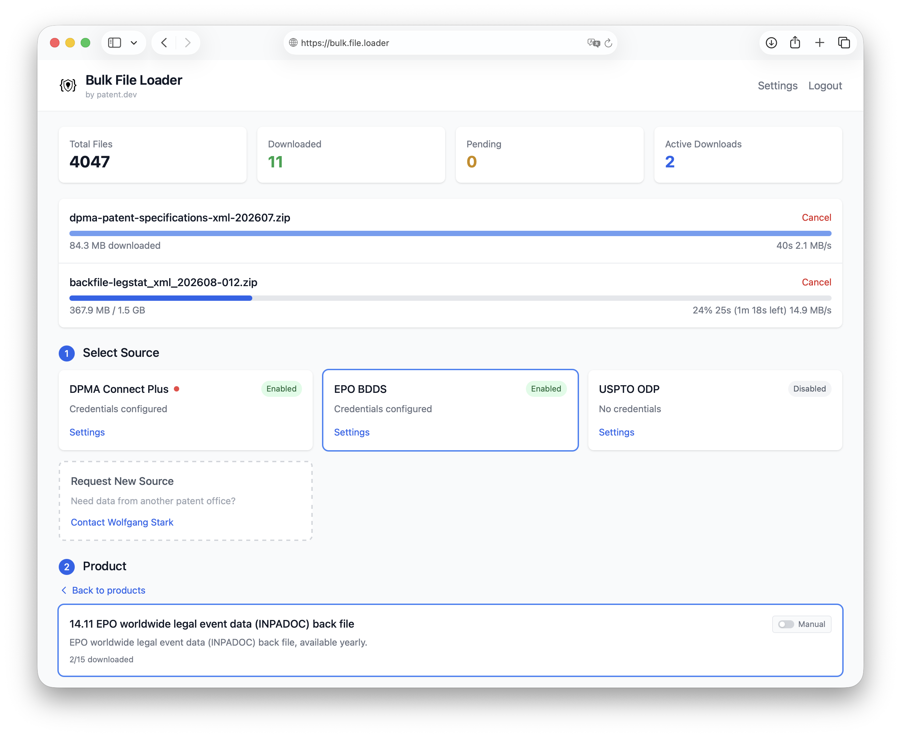

# Bulk File Loader

Automated bulk data download manager for patent data.



## Features

- Automated scheduled downloads from EPO and USPTO
- Web UI for configuration and monitoring
- Webhook notifications
- Multi-database support (SQLite, PostgreSQL, MySQL)

## Quick Start

```bash
# Using Docker
docker run -p 8080:8080 -v ./data:/app/data patentdev/bulk-file-loader

# Or download binary from releases
./bulk-file-loader
```

Open http://localhost:8080 and set your passphrase.

## Configuration

Environment variables:

| Variable | Default | Description |
|----------|---------|-------------|
| `BULK_LOADER_PASSPHRASE` | - | Required for auth |
| `BULK_LOADER_PORT` | 8080 | HTTP port |
| `BULK_LOADER_DATA_DIR` | ./data | Data directory |
| `BULK_LOADER_DB_DRIVER` | sqlite | Database driver |

## Related Projects

Part of the [patent.dev](https://patent.dev) open-source patent data ecosystem:

- [epo-ops](https://github.com/patent-dev/epo-ops) — EPO Open Patent Services client (search, biblio, legal status, family, images)
- [epo-bdds](https://github.com/patent-dev/epo-bdds) — EPO Bulk Data Distribution Service client (used by this project)
- [uspto-odp](https://github.com/patent-dev/uspto-odp) — USPTO Open Data Portal client (used by this project)
- [dpma-connect-plus](https://github.com/patent-dev/dpma-connect-plus) — DPMA Connect Plus client (patents, designs, trademarks)

## License

MIT - See [LICENSE](LICENSE)

---

Built by [patent.dev](https://patent.dev) - Wolfgang Stark
